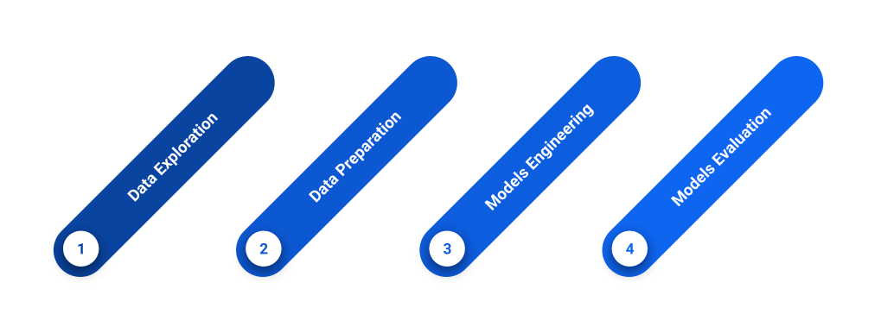
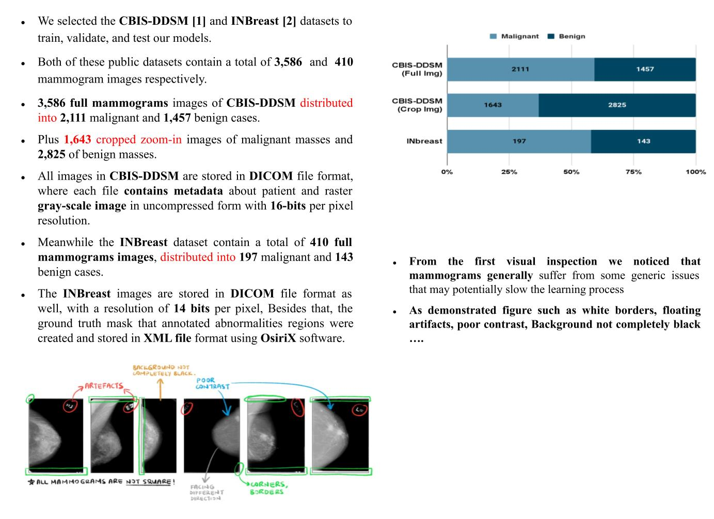

 </a>
 <h5 align="center" >My Master's Thesis</h5>

<h3 align="center"> A Hybrid Aproach for Breast Cancer Detection </h3>

  
  
  
  
  

---

Breast cancer is a dangerous kind of cancer that develops in the cells of the breast tissue. It is one of the most common types of cancer among women, but can also occur in men. It usually starts in the milk ducts or lobules, and can spread to other parts of the body if not treated early. Some common signs and symptoms of breast cancer include a lump or thickening in the breast or armpit, changes in the size or shape, dimpling or puckering of skin, nipple discharge, and redness or scaling of the nipple. This may develop over time, invade surrounding breast tissue, and then spread to nearby organs or other body parts through blood vessels. 

the wonderful news is that its treatment can be highly effective, achieving survival probabilities of 90% or much higher, particularly when diagnosed early. Motivated by this fact, we intend out of our moral and humanitarian duty, to support healthcare professionals in diagnosing diseases. Through designing and implementing a computer-aided diagnosis (CAD) system that can analyze mammogram images and identify and isolate suspicious areas that may require further evaluation by a radiologist. 

#### Project Workflow

 

#### (1) Data Exploration

 

